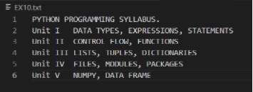

# Word-count
## AIM:
To write a python program for getting the word count from a text.
## EQUIPEMENT'S REQUIRED: 
PC
Anaconda - Python 3.7
## ALGORITHM: 
### Step 1:
Open the file in read access mode.

### Step 2:
Intialize a variable with 0(word).

### Step 3:
Iterate the content of the file using for loop.

### Step 4:
Split the contents into each line using .split() function.

### Step 5:
Iterate the list of lines and increment the value of variable (word) each time.

### Step 6:
End of the Program. 
 

## PROGRAM:
```
#Program to count the total number of words.
#Developed by: Paul Andrew D
#RegisterNumber: 21500230

with open("EX10.txt","r") as fp:
    words = 0
    for data in fp:
        lines=data.split()
        for line in lines:
            words += 1
    print("Total No.of Words:",words)
```
## EX10.txt file:

## OUTPUT:


## RESULT:
Thus the program is written to find the word count from a text.
